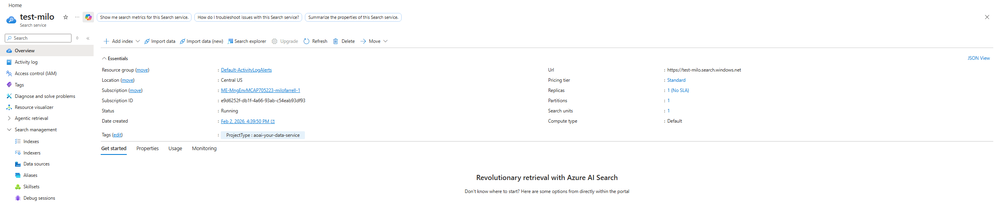
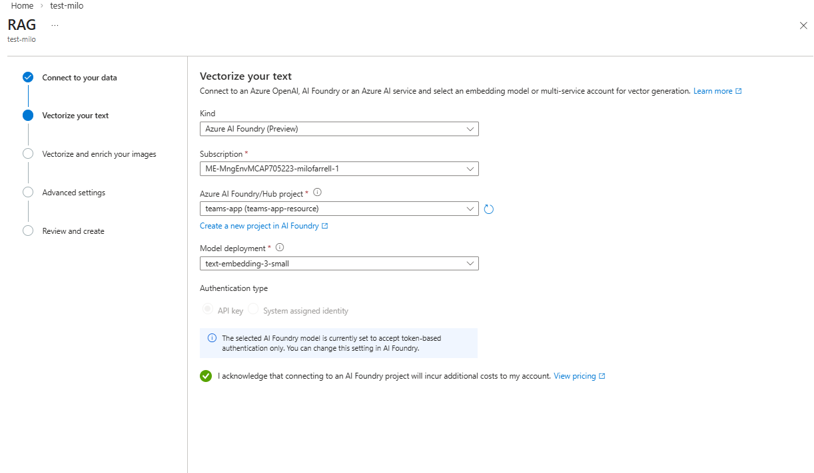

# 🤖 Azure AI Foundry RAG Chatbot Tutorial

A hands-on tutorial for building a RAG (Retrieval-Augmented Generation) chatbot using Azure AI Foundry. You'll start with a basic UI and progressively add AI capabilities.

> ℹ️ **Note:** These instructions are written for the **old Azure AI Foundry portal**. The model-based approach (Steps 2-3) works the same in both old and new portals with some slight UI differentces. However agents are different between the portals and so a minor code change is needed there, see [Stretch Goal 1](#stretch-goal-1-use-a-new-foundry-agent).

## 🎯 What You'll Learn

By the end of this tutorial, you will have:
- ✅ A working chat UI connected to Azure OpenAI
- ✅ RAG capabilities using Azure AI Search
- ✅ Understanding of how these components work together

## 📋 Prerequisites

- A GitHub account
- An Azure subscription with access to Azure OpenAI
- Basic familiarity with Python

---

## Step 1: Launch the Codespace and Explore

### 1.1 Start the Codespace

1. Click the **"Code"** button on this GitHub repository
2. Select **"CodeSpace"** → **"Create codespace on main"**
3. Wait for the environment to build (this takes a few minutes)

### 1.2 Explore the Project Structure

Once the Codespace is ready, take a look at the files:

```
FoundryRagBasicDemo/
├── app.py                   # Flask backend (you'll modify this!)
├── templates/
│   └── index.html           # Chat UI (already complete)
├── .env.example             # Environment template
├── requirements.txt         # Python dependencies
└── README.md                # This tutorial
```

### 1.3 Run the App

1. Open the terminal in VS Code
2. Run the app:
   ```bash
   python app.py
   ```
3. When the popup appears, click **"Open in Browser"** (or go to the Ports tab and click the globe icon)

### 1.4 Test the UI

You'll see a chat interface. Try sending a message - you'll get:

> 💡 Chat not configured yet! Complete Step 2 in the README to connect to Azure OpenAI.

This is expected! The UI works, but we haven't connected it to an AI model yet.

---

## Step 2: Connect to Azure OpenAI

Now let's make the chatbot actually chat!

### 2.1 Get Your Azure OpenAI Details

You'll need these from the Azure Portal:

| Item | Where to Find |
|------|---------------|
| **Endpoint URL** | In foundry -> Overview -> Endpoint and Keys -> Azure Open AI -> Azure OpenAI Endpoint |
| **API Key** | In foundry -> Overview -> Endpoint and Keys -> Azure Open AI -> Keys (Key 1 or Key 2) |
| **Deployment Name** | Azure AI Foundry → Models + Endpoints -> Find the name of your model (e.g., `gpt-4`, `gpt-4o`) |

If you do not have a model deployment you can create one. Go to Models + Endpoints -> Deploy Model -> Deploy Base Model -> Search And Choose Gpt-4.1 -> leave everything as default and click deploy.

### 2.2 Update the .env File
Create a copy of the `.env.example` file, call it `.env`.

Open `.env` and add your values, for example:
```bash
AZURE_AI_ENDPOINT=https://your-resource.openai.azure.com/
AZURE_AI_KEY=your-api-key-here
AZURE_AI_DEPLOYMENT=gpt-4
```

### 2.3 Update app.py - Add Imports

Open `app.py` and find the TODO comment near the top. **Uncomment** this import:

```python
from openai import AzureOpenAI
```

### 2.4 Update app.py - Add the Chat Logic

Find the `chat()` function with the placeholder response. **Replace** the entire function with:

```python
@app.route("/api/chat", methods=["POST"])
def chat():
    """Handle chat requests."""
    try:
        data = request.json
        user_message = data.get("message", "")
        conversation_history = data.get("history", [])
        
        if not user_message:
            return jsonify({"error": "No message provided"}), 400
        
        # Get Azure OpenAI client
        endpoint = os.getenv("AZURE_AI_ENDPOINT")
        api_key = os.getenv("AZURE_AI_KEY")
        if not endpoint or not api_key:
            return jsonify({"error": "Azure AI endpoint or API key not configured"}), 500
        
        client = AzureOpenAI(
            azure_endpoint=endpoint,
            api_key=api_key,
            api_version="2024-02-15-preview"
        )
        
        deployment = os.getenv("AZURE_AI_DEPLOYMENT", "gpt-4")
        
        # Build messages array
        messages = [
            {
                "role": "system",
                "content": "You are a helpful AI assistant. Answer questions clearly and concisely."
            }
        ]
        
        # Add conversation history
        for msg in conversation_history:
            messages.append({"role": msg["role"], "content": msg["content"]})
        
        # Add current user message
        messages.append({"role": "user", "content": user_message})
        
        # Call Azure OpenAI
        response = client.chat.completions.create(
            model=deployment,
            messages=messages,
            max_tokens=1000,
            temperature=0.7
        )
        
        assistant_message = response.choices[0].message.content
        
        return jsonify({
            "message": assistant_message,
            "citations": [],
            "rag_enabled": False
        })
        
    except Exception as e:
        return jsonify({"error": f"An error occurred: {str(e)}"}), 500
```

### 2.5 Test Your Chat

1. Restart the app (press `Ctrl+C` and run `python app.py` again)
2. Refresh your browser
3. Try chatting - you should now get real AI responses! 🎉

---

## Step 3: Add RAG with Azure AI Search

Now let's add the ability to chat with your own documents!
### 3.1 Deploy and Ebeddings Model

We are going to deploy and embedings model to enabel our vector search.
Go to Foundry -> select your project -> go to Models + Endpoints -> Deploy model -> Deploy Base model -> Search `text-embedding-3-small` -> select it and click confirm -> Leave everything as default and click deploy.


### 3.2 Upload Documents to Azure Storage

A storage account has already been created for you.

1. Go to the **Azure Portal**
2. Navigate to the existing **Storage Account**
3. Go to **Containers**, click add continer, name it somthing unique to you.
4. Click on the neq container
5. Upload some PDF, Word, or text files to the container using the upload button. You will find an example pdf in this repository if needed.

### 3.3 Create an Azure AI Search Index

An Azure AI Search service has already been created for you.

1. Go to the **Azure Portal** and navigate to the existing **Azure AI Search** service
2. Click **"Import data (new)" on the top bar.** 
3. Select **Azure Blob Storage** as your data source
4. Select RAG
5. Select your subscription, the storage account where you upload the example files and the contianer you uploaded your files to. You can leave Blob Folder, Parsing Mode, Enable deletion tracking and autneticate using managed identity as the default values.
6. Click Next
4. Select to use Azure Ai foundry (preview), select your subscription, select your azure Ai Foundry Project, Select your ebedding model. 
5. Select Next
6. Leave `Vectorize your images` and `enrich your data with AI skills` unchecked and click next.
7. Click create and wait for it to finish.


### 3.4 Get Your Search Key

1. In your **Azure AI Search** service, go to **Settings** → **Keys**
2. Copy the **Primary admin key**

### 3.5 Update .env with Search Settings

Add these lines to your `.env` file:
```bash
AZURE_SEARCH_ENDPOINT=https://your-search-service.search.windows.net
AZURE_SEARCH_KEY=your-admin-key-here
AZURE_SEARCH_INDEX=your-index-name
```

### 3.6 Update app.py - Add RAG Support

**Replace** the `chat()` function with this enhanced version that includes RAG:

```python
@app.route("/api/chat", methods=["POST"])
def chat():
    """Handle chat requests with optional RAG."""
    try:
        data = request.json
        user_message = data.get("message", "")
        conversation_history = data.get("history", [])
        
        if not user_message:
            return jsonify({"error": "No message provided"}), 400
        
        # Get Azure OpenAI client
        endpoint = os.getenv("AZURE_AI_ENDPOINT")
        api_key = os.getenv("AZURE_AI_KEY")
        if not endpoint or not api_key:
            return jsonify({"error": "Azure AI endpoint or API key not configured"}), 500
        
        client = AzureOpenAI(
            azure_endpoint=endpoint,
            api_key=api_key,
            api_version="2024-02-15-preview"
        )
        
        deployment = os.getenv("AZURE_AI_DEPLOYMENT", "gpt-4")
        
        # Build messages array
        messages = [
            {
                "role": "system",
                "content": "You are a helpful AI assistant. Answer questions clearly and concisely. If you're using information from a knowledge base, mention that in your response."
            }
        ]
        
        for msg in conversation_history:
            messages.append({"role": msg["role"], "content": msg["content"]})
        
        messages.append({"role": "user", "content": user_message})
        
        # Check if RAG is configured
        search_endpoint = os.getenv("AZURE_SEARCH_ENDPOINT")
        search_key = os.getenv("AZURE_SEARCH_KEY")
        search_index = os.getenv("AZURE_SEARCH_INDEX")
        
        extra_body = None
        rag_enabled = False
        
        if search_endpoint and search_key and search_index:
            rag_enabled = True
            extra_body = {
                "data_sources": [
                    {
                        "type": "azure_search",
                        "parameters": {
                            "endpoint": search_endpoint,
                            "index_name": search_index,
                            "authentication": {
                                "type": "api_key",
                                "key": search_key
                            },
                            "query_type": "simple",
                            "top_n_documents": 5
                        }
                    }
                ]
            }
        
        # Call Azure OpenAI
        if extra_body:
            response = client.chat.completions.create(
                model=deployment,
                messages=messages,
                extra_body=extra_body,
                max_tokens=1000,
                temperature=0.7
            )
        else:
            response = client.chat.completions.create(
                model=deployment,
                messages=messages,
                max_tokens=1000,
                temperature=0.7
            )
        
        assistant_message = response.choices[0].message.content
        
        # Extract citations if available
        citations = []
        if hasattr(response.choices[0].message, 'context') and response.choices[0].message.context:
            context = response.choices[0].message.context
            if 'citations' in context:
                citations = context['citations']
        
        return jsonify({
            "message": assistant_message,
            "citations": citations,
            "rag_enabled": rag_enabled
        })
        
    except Exception as e:
        return jsonify({"error": f"An error occurred: {str(e)}"}), 500
```

### 3.7 Test RAG

1. Restart the app
2. Ask questions about the content in your uploaded documents
3. You should see a **"📚 Using knowledge base"** badge on responses!

---

## Step 4: Alternative RAG with Azure AI Foundry Agents

Azure AI Foundry Agents offer another way to implement RAG. Instead of manually configuring Azure AI Search in your code, you can create an Agent in Azure AI Foundry that handles document retrieval automatically. This approach simplifies your code and centralizes the RAG configuration in the portal.

### 4.1 Create an Agent in Azure AI Foundry

1. Go to [Azure AI Foundry](https://ai.azure.com)
2. Select your project (or create one if needed)
3. Navigate to **Agents** in the left menu
4. Click **+ New agent**
5. Give your agent a name (e.g., `document-assistant`)
6. Select a model (e.g., `gpt-4o`)
7. Add instructions for your agent:
   ```
   You are a helpful assistant that answers questions based on the uploaded documents. 
   Always cite the source document when providing information.
   ```

### 4.2 Upload Documents to the Agent

1. In your agent's configuration, find the **Knowledge** section
2. Click **+ Add files**
3. Upload the same PDF, Word, or text files you used earlier
4. Wait for the files to be processed (this may take a few minutes)
5. The agent will automatically index the documents for retrieval

### 4.3 Get Your Agent ID and Project Endpoint

1. In your agent's page, look for the **Agent ID** (it looks like `asst_xxxxxxxxxxxx`)
2. Copy this ID - you'll need it in your code
3. Go to **Overview** (Top of the left bar)
4. In the Endpoints and Keys get the Microsft Foundry Enpoint:
   ```
   https://<your-hub>.services.ai.azure.com/api/projects/<project-name>
   ```


> ⚠️ **Important:** The endpoint for Agents is the **Project endpoint**, not the Azure OpenAI resource endpoint. If you get a "No assistant found" error, this is likely the issue!

### 4.4 Update .env with Agent Settings

Add these lines to your `.env` file:

```bash
# Agent Configuration
# Use the PROJECT endpoint from AI Foundry, not the OpenAI resource endpoint!
AZURE_AI_ENDPOINT=https://your-hub.services.ai.azure.com/api/projects/your-project
AZURE_AI_KEY=your-api-key-here
AZURE_AGENT_ID=asst_your-agent-id-here
```

> ⚠️ **No quotes around values!** The `.env` file should have no quotes or trailing spaces.


### 4.5 Update app.py - Add Agent Support

Replace the imports at the top of your `app.py`:

```python
import os
from flask import Flask, render_template, request, jsonify
from dotenv import load_dotenv
from azure.ai.projects import AIProjectClient
from azure.ai.agents.models import ListSortOrder
from azure.core.credentials import AzureKeyCredential
```

Then replace the `chat()` function with this agent-based version:

```python
@app.route("/api/chat", methods=["POST"])
def chat():
    """Handle chat requests using Azure AI Foundry Agent."""
    try:
        data = request.json
        user_message = data.get("message", "")
        
        if not user_message:
            return jsonify({"error": "No message provided"}), 400
        
        # Get Azure AI Foundry settings
        endpoint = os.getenv("AZURE_AI_ENDPOINT")
        api_key = os.getenv("AZURE_AI_KEY")
        agent_id = os.getenv("AZURE_AGENT_ID")
        
        if not endpoint or not api_key or not agent_id:
            return jsonify({"error": "Agent not configured. Set AZURE_AI_ENDPOINT, AZURE_AI_KEY, and AZURE_AGENT_ID"}), 500
        
        # Create the AI Project client
        project = AIProjectClient(
            credential=AzureKeyCredential(api_key),
            endpoint=endpoint
        )
        
        # Get the agent
        agent = project.agents.get_agent(agent_id)
        
        # Create a new thread
        thread = project.agents.threads.create()
        
        # Add the user message
        project.agents.messages.create(
            thread_id=thread.id,
            role="user",
            content=user_message
        )
        
        # Run the agent and wait for completion
        run = project.agents.runs.create_and_process(
            thread_id=thread.id,
            agent_id=agent.id
        )
        
        if run.status == "failed":
            return jsonify({"error": f"Agent run failed: {run.last_error}"}), 500
        
        # Get the response
        messages = project.agents.messages.list(
            thread_id=thread.id,
            order=ListSortOrder.DESCENDING
        )
        
        # Find the assistant's message
        assistant_message = ""
        citations = []
        
        for msg in messages:
            if msg.role == "assistant" and msg.text_messages:
                assistant_message = msg.text_messages[-1].text.value
                break
        
        return jsonify({
            "message": assistant_message,
            "citations": citations,
            "rag_enabled": True,
            "thread_id": thread.id,
            "agent_mode": True
        })
        
    except Exception as e:
        return jsonify({"error": f"An error occurred: {str(e)}"}), 500
```

### 4.7 Compare the Two RAG Approaches

| Feature | Azure AI Search RAG (Step 3) | Foundry Agent RAG (Step 4) |
|---------|------------------------------|----------------------------|
| **Setup** | Configure search index, embeddings, and connection in code | Upload files directly in AI Foundry portal |
| **SDK** | `openai` package | `azure-ai-projects` package |
| **Flexibility** | Full control over search parameters | Agent handles retrieval automatically |
| **Conversation** | Manual history management | Built-in thread management |
| **Best For** | Custom search requirements, fine-tuned retrieval | Quick setup, simpler use cases |

### 4.8 Test Agent-Based RAG

1. Restart the app
2. Chat with your agent - it will use the documents you uploaded in AI Foundry!
3. The agent will automatically search through your uploaded documents!

> 💡 **Tip:** You can switch between the two approaches based on your needs. Use Azure AI Search for more control, or Agents for simpler setup and built-in conversation management.

---

## 🎉 Congratulations!

You've built a RAG chatbot with two different approaches! Here's what you accomplished:

1. ✅ Set up a development environment with Codespaces
2. ✅ Connected a web UI to Azure OpenAI
3. ✅ Added RAG capabilities with Azure AI Search
4. ✅ Implemented alternative RAG using Azure AI Foundry Agents

---

## 🌟 Stretch Goals

Finished early? Try these challenges! These are intentionally less detailed - you'll need to explore and experiment.

### Stretch Goal 1: Use a New Foundry Agent

**Goal:** Replace the old agent implementation with a new Foundry agent for improved capabilities and performance.

**Hints:**
- Create a new agent in Azure AI Foundry under the Agents section
- Configure the agent with your desired system prompt, model and knowledge.
- Look Under the code section in the portal to get an sample on how to conenct to the agent.


**Benefits:** New Foundry agents provide built-in conversation management, easier tool integration, and better observability through the Azure AI Foundry portal.

---

### Stretch Goal 2: Add Image Generation to Chat

**Goal:** When a user asks for an image (e.g., "draw me a cat"), the chat should generate and display it inline.

**Hints:**
- Deploy a `dall-e-3` model in Azure AI Foundry
- Add `AZURE_DALLE_DEPLOYMENT` to your `.env`
- Use function calling to detect when a user wants an image (define a `generate_image` tool)
- Call `client.images.generate()` to create the image
- Return the image URL in your response and update the frontend to render `` tags
- The response format: `response.data[0].url` contains the generated image URL

**Key API:**
```python
response = client.images.generate(
    model=dalle_deployment,
    prompt=user_prompt,
    n=1,
    size="1024x1024"
)
image_url = response.data[0].url
```

**Frontend hint:** Check if the response contains an image URL and render it with ``.

---

### Stretch Goal 3: Call External APIs with Function Calling

**Goal:** Add tools that let the AI call external APIs - and use a Request Bin to visualize what it sends!

**Hints:**
- Create a request bin at [https://rbin.passkit.com/](https://rbin.passkit.com/) - keep the inspect page open
- Define tools in your chat endpoint using the `tools` parameter
- When the model returns `tool_calls`, execute them by POSTing to your request bin
- Return the result and let the model summarize it

**Tool definition pattern:**
```python
tools = [{
    "type": "function",
    "function": {
        "name": "send_notification",
        "description": "Send a notification to someone",
        "parameters": {
            "type": "object",
            "properties": {
                "recipient": {"type": "string"},
                "message": {"type": "string"}
            },
            "required": ["recipient", "message"]
        }
    }
}]
```

**Key concepts:**
- Pass `tools=tools, tool_choice="auto"` to `chat.completions.create()`
- Check `response.choices[0].message.tool_calls` for function requests
- Execute the function, then call the API again with the result as a `tool` message
- Watch your request bin to see exactly what the AI decides to send!

**Try asking:** "Send a notification to Sarah about the project deadline"

---

## 🚀 Next Steps

Try these enhancements:

- **Customize the system prompt** to give your bot a personality
- **Modify the UI** in `templates/index.html` to toggle between RAG approaches
- **Try different models** by changing the deployment
- **Experiment with search settings** like `query_type: "semantic"`
- **Add tools to your Agent** for more advanced capabilities
- **Combine features** - Add function calling to your RAG agent!

## ❓ Troubleshooting

### "Chat not configured" message persists
- Make sure you uncommented the imports in `app.py`
- Verify `.env` has the correct `AZURE_AI_ENDPOINT` and `AZURE_AI_KEY` values

### Authentication errors
- Verify your `AZURE_AI_KEY` is correct and not expired
- Make sure the API key has permissions to access the Azure OpenAI resource

### "Model not found"
- Check that `AZURE_AI_DEPLOYMENT` matches your deployment name exactly

### RAG not working
- Verify all three search variables are set in `.env`
- Make sure your search index has documents in it

## 📚 Resources

- [Azure OpenAI Documentation](https://learn.microsoft.com/azure/ai-services/openai/)
- [Azure AI Search Documentation](https://learn.microsoft.com/azure/search/)
- [Flask Documentation](https://flask.palletsprojects.com/)
